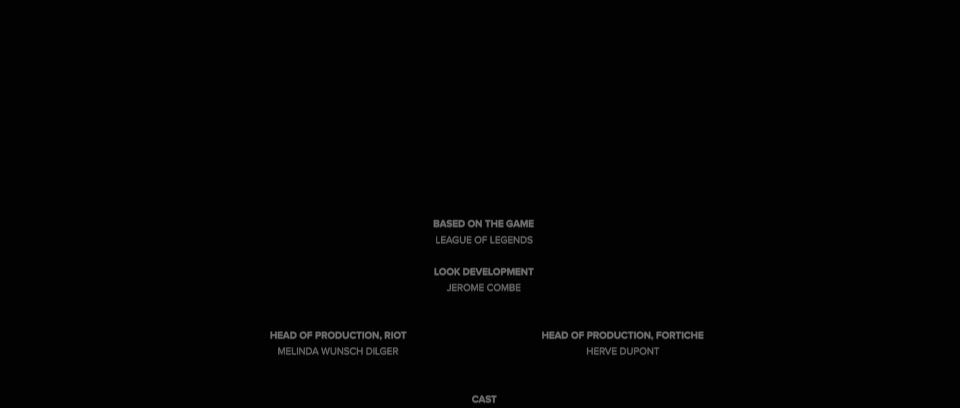

# arcane-frames

This project extracts frames from videos (such as the Netflix show *Arcane*) and generates a slideshow as a Desktop wallpaper in HTML format.

## "Pipeline" right now

* You need video files in the `episodes/` subfolder.
* Run `index.py` to build the database.
* Run `extract_images.py` to populate `export/images/`.
* Run `export.py` to update `export/filenames.js`.
* Use `Lively Wallpaper`, `WallpaperWebPage`, `Wallpaper Engine`, or similar to set `export/index.html` as a wallpaper.

## Quality model

During indexing, each frame's quality is estimated using a neural net that takes Resnet50 embeddings and class probabilities as input.
Resnet50 (`torchvision.models.resnet50`) is a pretrained image classifier that outputs 1000 class probabilities at the last layer.
The second to last layer outputs a 2048-dimensional embedding vector that captures general image features.

```
[Image] -> [Conv2D] -> [BatchNorm] -> [ReLU] -> [MaxPool] -> ...

  -> [AvgPool2d] -> [Dense] -> [Softmax] -> Class probabilities (1000)
                  \
                   -> Embeddings (2048)
```

The quality model is a feedforward network that uses these two concatenated vectors as input and outputs a single quality score.
This low-dimensional input captures general image characteristics and allows for a high sample efficiency.

```
[Embeddings (2048)] + [Class probabilities (1000)]

  -> [Dense (512)] -> [ReLU] -> [Dense (128)] -> [ReLU] -> [Dense (1)]

  -> Quality score
```

Quality labels are generated by `label_quality.py` by randomly sampling frames from `episodes/` and manually rating them on a scale of 1 to 5.
The model is trained using mean squared error loss in `train_quality.py`.

## Quality estimation examples

|  |
|--------------------------|
| Best quality (q=1.8)     |

----------------------------

|  |
|----|
| Median quality (q=0.3) |

----------------------------

|  |
|----|
| Worst quality (q=-2.5) |
